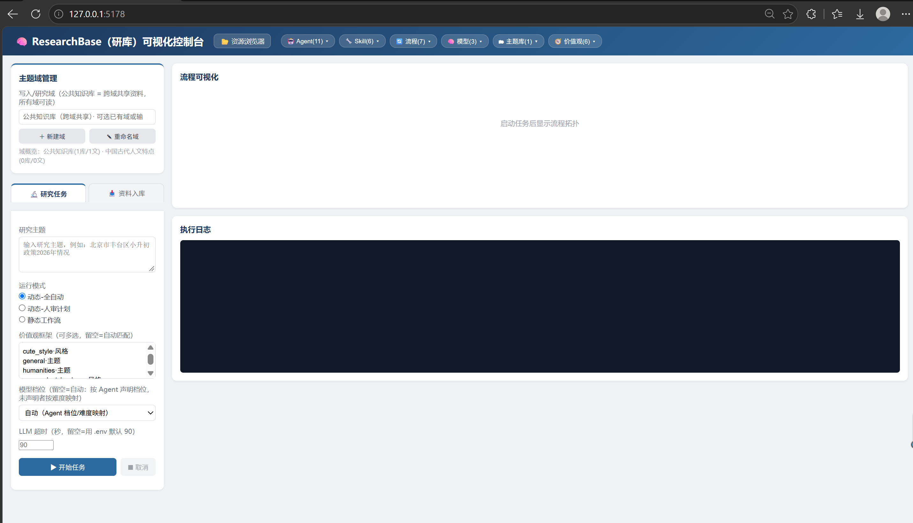

# ResearchBase（研库）

> Lightweight, pluggable, dual-engine, human-in-the-loop **multi-agent research pipeline** for Python.
> Feed a topic → agents research → get a structured article — while you keep full control at every step.

**English** · [中文](README.zh-CN.md)

ResearchBase is a personal knowledge & research assistant framework. It combines **two scheduling engines** (LLM-driven dynamic planning + fixed LangGraph workflows), **auto-registered pluggable agents/skills/flows**, a **value-system & long-term memory** layer, **topic-domain isolation** for your local knowledge base, and a **zero-dependency Web GUI** — all designed to be **maintained by AI** (AI-friendly comments, `AGENTS.md` as single source of truth) while staying human-readable.



---

## Features

- **Dual engines, one agent pool**
  - *Dynamic Planner*: LLM generates a task plan from your goal; you can review/edit the plan before execution.
  - *Static Workflows*: fixed LangGraph topologies with `interrupt` breakpoints, checkpointing and resume.
- **Pluggable everything** — drop a file into `agent_registry/agents/`, `skills/`, `planner/flows/` or `memory/profiles/` and it is auto-registered. No scheduler changes needed.
- **Human-in-the-loop symmetry**: plan review & mid-run breakpoints in dynamic mode; `interrupt` pauses in static mode.
- **Topic-domain isolation**: your materials, outputs and archives are separated per domain (`domains/<name>/`), with a shared global layer and domain-private libraries.
- **Values & memory system**: pluggable value frameworks (stance / evidence / style / critique) auto-matched by topic or explicitly selected; long-term memory sedimentation.
- **Knowledge base management**: topic-indexed local database with 3-level reading (overview → summary → full text) to save tokens; URL/local-file/text ingestion with topic normalization and smart merge.
- **Research process archival**: every run is archived (plan + agent outputs + final article) for traceability and replay.
- **Fact-checking with bounded revision loop**: a `fact_checker` agent reviews facts/hallucinations, with a bounded retry loop (max 2 revisions).
- **Web GUI + resource browser**: visual task control with live flow graph & logs, plus a built-in read-only/edit asset browser.
- **Cost & usage tracking**: real token usage per model, priced per tier, logged per task.
- **AI-maintainable codebase**: six-part AI-readable header comments, `AGENTS.md` as the design contract.

---

## Architecture

```
┌────────────────────────────────────────────────────────────────┐
│                        Entry Points                            │
│   main.py (CLI)          gui_web.py (Web UI :5178)             │
└───────────────┬───────────────────────────────┬────────────────┘
                │                               │
┌───────────────▼──────────────┐   ┌────────────▼────────────────┐
│   Dynamic Planner            │   │  Static Workflow (LangGraph) │
│   LLM-generated JSON plan    │   │  Fixed DAG + interrupt       │
│   plan review / re-generate  │   │  checkpoint / resume         │
└───────────────┬──────────────┘   └────────────┬────────────────┘
                │                               │
                └───────────────┬───────────────┘
                                ▼
              ┌──────────────────────────────────┐
              │   Agent Registry (auto-load)    │
              │   task_router · researcher ·    │
              │   writer · fact_checker · ...   │
              └───────────────┬──────────────────┘
                              ▼
              ┌──────────────────────────────────┐
              │   Skills (auto-registered tools)│
              │   read/write topic DB · fetch   │
              └───────────────┬──────────────────┘
                              ▼
              ┌──────────────────────────────────┐
              │   Unified State + Memory/Values  │
              │   Domains (topic isolation)      │
              └──────────────────────────────────┘
```

Key design decisions:

- **One state, incremental merge** — every agent reads the global `State` and returns only the fields it updates.
- **Values separate from roles** — an agent's persona (who it is) and the value framework (how it behaves) are loosely coupled through dimension tags.
- **Domains are task parameters** — a domain is snapshotted when a task starts; reads fall back domain → global.

---

## Quick Start

### 1. Requirements

- **Python 3.11+**
- Internet access to your LLM provider (OpenAI-compatible APIs)

### 2. Install

```bash
git clone https://github.com/Cenozoic-Jarlar/ResearchBase.git
cd ResearchBase

# create virtual environment
python -m venv venv

# Windows (PowerShell)
venv\Scripts\activate
# Linux / macOS
source venv/bin/activate

pip install -r requirements.txt          # runtime deps
pip install -r requirements-dev.txt      # dev/test deps (pytest, pytest-cov)
```

### 3. Configure

1. Copy `.env.example` to `.env` and fill in your API keys:

```bash
cp .env.example .env
```

2. Edit `.env` — at minimum:

```ini
# Global fallback key/base URL (used by tiers without their own key)
LLM_API_KEY=sk-your-key
LLM_BASE_URL=https://api.openai.com/v1

# Optional: per-tier key override, e.g. reasoning tier
LLM_REASONING_API_KEY=sk-your-reasoning-key
```

3. (Optional) Edit `manual_settings.py` — the human/AI global settings file holding the **model registry** (tiers → model names, base URLs, prices) and runtime parameters. **Keys live only in `.env`**; `manual_settings.py` references them via `os.getenv(...)` and is safe to commit.

### 4. Run

```bash
# Command line — interactive (choose mode: dynamic-auto / dynamic-review / static)
python main.py

# Non-interactive domain
DOMAIN="work-a" python main.py

# Web GUI (auto-opens http://127.0.0.1:5178)
python gui_web.py

# Resource browser (standalone, :5179) — also available inside the GUI at /resource-browser
python -m resource_browser

# Markdown → Word
python md2docx.py [file-or-directory]
```

> Ports are overridable: `GUI_PORT`, `RES_PORT` (defaults 5178 / 5179).

---

## Usage Examples

```bash
# Research a topic and write an article
python main.py
# → input a topic, e.g. "北京市丰台区小升初政策2026年情况，以及与2025年相比的变化"
# → choose mode 1 (dynamic auto) or 3 (static workflow)

# Force a specific value style (CLI)
PROFILES="cute_style,policy" python main.py

# Force a model tier for a task
MODEL_TIER="reasoning" python main.py
```

Or use the Web GUI: pick a domain (or the shared global layer), type a topic, choose a mode, and watch the flow graph update live. You can also ingest materials (URL / local files / pasted text) into the knowledge base from the GUI.

---

## Configuration Reference

| File | Purpose | Editable by |
|---|---|---|
| `.env` | API keys & secrets only (gitignored) | Human only |
| `.env.example` | Key template with placeholders (committed) | Human/AI |
| `manual_settings.py` | Model registry (tiers, models, base URLs, prices) + runtime params | Human & AI |
| `AGENTS.md` | Design contract / single source of truth for AI | Human & AI |
| `core/settings_io.py` | Backend that lets the GUI edit `manual_settings.py` safely (AST block replace + syntax check + `.bak` backup) | — |

### Model tiers (3)

| Tier | Purpose | Typical model |
|---|---|---|
| `router` | routing, simple Q&A (cheap & fast) | `deepseek-ai/DeepSeek-V4-Flash` |
| `standard` | daily research / writing / review | `deepseek-ai/DeepSeek-V4-Pro` |
| `reasoning` | deep reasoning (opt-in) | `deepseek-reasoner` |

Decision chain: **task-specified tier (GUI/CLI) → agent's declared tier → difficulty mapping (simple→router, complex→standard) → standard default.**

---

## Testing

All 14 test modules mock the LLM — **fully offline, no API cost**.

```bash
# one by one
python test_agent_system-ok.py
python test_web_gui.py
...

# or via pytest (all)
pytest -q
pytest --cov=. --cov-report=term-missing   # coverage
```

Tests cover: agent/skill/flow auto-registration, both engines, knowledge-base read/write, ingestion pipeline (normalization, merge, write modes), memory & values, fact-check bounded loop, archival, domains, Web GUI task state machine, resource browser permissions, model-config editor, and LLM usage statistics.

> Maintenance rule: test files are assets — never delete them; replace a test file wholesale when its logic changes.

---

## Extending

- **New Agent**: copy `agent_registry/agents/_agent_template.py` → implement `run(state)` + `AGENT_META` (must include `tier`) → place in `agents/` → restart. The dynamic planner auto-selects it from `description`.
- **New Skill**: copy an existing skill → `run()` + `SKILL_META` (description written for the LLM) → place in `skills/`.
- **New Value framework**: copy `memory/profiles/_profile_template.py` → `PROFILE_META` → place in `profiles/`. Topic-matched or explicitly selected.
- **New Static Flow**: copy `planner/flows/_flow_template.py` → `build()` + `FLOW_META` → place in `flows/` → appears in the GUI dropdown automatically.
- **New model tier**: add one block to `manual_settings.MODELS` (with prices) — the GUI dropdown picks it up with zero code changes.

---

## Directory Structure

```
ResearchBase/
├─ main.py                  # CLI entry (3 modes)
├─ gui_web.py               # Web GUI entry (Flask, :5178)
├─ md2docx.py               # Markdown → Word tool
├─ manual_settings.py       # ★ human/AI global settings (model registry + runtime)
├─ llm_config.py            # tier registry + get_llm() + usage logging
├─ state_model.py           # global State (single source)
├─ AGENTS.md                # design contract for AI maintenance
├─ core/                    # logger / paths / settings_io / domain_config
├─ agent_registry/          # auto-registered agents
├─ planner/                 # dynamic planner + static flows (LangGraph)
├─ skills/                  # auto-registered LLM-callable tools
├─ memory/                  # value frameworks + long-term memory
├─ tools/                   # internal non-LLM helpers (output/archive/docx)
├─ web_gui/                 # Flask app + task state machine
├─ resource_browser/        # standalone asset browser plugin
├─ domains/                 # topic-domain isolation (materials/output/archives)
├─ LocalDataBase/           # topic-indexed knowledge base (gitignored)
├─ archives/                # research process archives (gitignored)
├─ logs/                    # run logs (gitignored)
├─ output/                  # generated articles (gitignored)
└─ test_*.py                # 14 offline test modules
```

---

## Roadmap & Known Limitations

- **Known issue**: the fact-check revision loop's second pass may pass without verifying each item from the first issue list (see `AGENTS.md` §7). Not yet fully fixed.
- Planned: parallel sub-question research, result caching, multi-turn conversational research, comparison flows, search-engine integration, task history replay UI, cross-platform verification.

---

## License

[MIT](LICENSE) © 2026 ResearchBase Contributors
